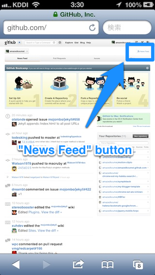
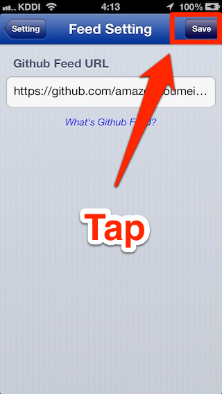

---

+ [What's Github feed?](#whats_github_feed)
+ [How to set Github feed to Octofeed?](#how_to_set_github_feed_to_octofeed)

---

<h1 id="whats_github_feed"> </h1>
## What's Github feed?

Github feed is RSS feed notice you your following person's action and your watching repository's like below

+ your following person's
  + push to
  + create repository 
  + fork repository
  + star repository
  + create gist
  + update gist
  + *and more

+ your watching repository's
  + push to
  + pull request
  + merge pull request
  + close pull request
  + comment pull request
  + open issue 
  + comment issue
  + edit wiki
  + *and more

---

<h1 id="how_to_set_github_feed_to_octofeed"> </h1>
## How to set Github feed to Octofeed?

---

####1. Open Safari and go to [https://github.com/](https://github.com/) and Sign in.

---

####2. Pay attention "News Feed" button at the upper left.

 

---

####3. Press long "News Feed" button and tap "Copy".
 
 

---

####4. Launch Octofeed and tap "setting" button.
 

---

####5. Tap "Github Feed URL" menu.
 

---

####6. Tap and log press text field and paste to.
 

---

####7. Tap "save" button, then you finish setting.
 
 
